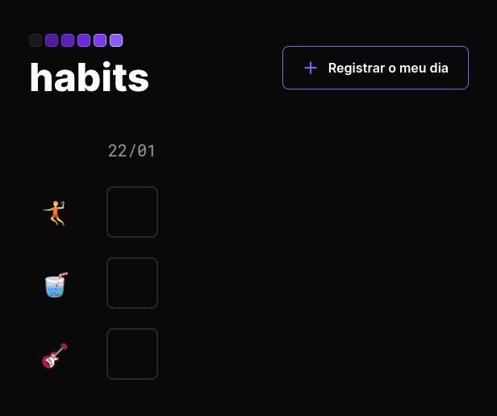

<h1 align="center"> Habits Tracker </h1>

Programa para registrar hábitos diários, feito com a mentoria da NLW's Rocketseat no curso explorer.  

  <a href="#-tecnologias">Tecnologias</a>&nbsp;&nbsp;&nbsp;|&nbsp;&nbsp;&nbsp;
  <a href="#-projeto">Projeto</a>&nbsp;&nbsp;&nbsp;|&nbsp;&nbsp;&nbsp;
  <a href="#-layout">Layout</a>&nbsp;&nbsp;&nbsp;|&nbsp;&nbsp;&nbsp;
  <a href="#memo-licença">Licença</a>

  

 

  

## 🚀 Tecnologias

Esse projeto foi desenvolvido com as seguintes tecnologias:

- HTML e CSS
- JavaScript
- Git e Github
- Figma
    

## 💻 Projeto

O Habits Tracker te ajuda a ter o estilo de vida que você procura.

- [Acesse o projeto finalizado, online](https://arthurvmbl.github.io/habitstracker-nlw/)
    

## 🔖 Layout

Você pode visualizar o layout do projeto através [desse link](<https://www.figma.com/file/7IBINrCHU3fBYBADB1peDL/Habits-(e)-(Community)?node-id=75%3A128&t=hxD8LH38YeiUvehG-1>).
  

## Licença

Esse projeto está sob a licença MIT.

---
